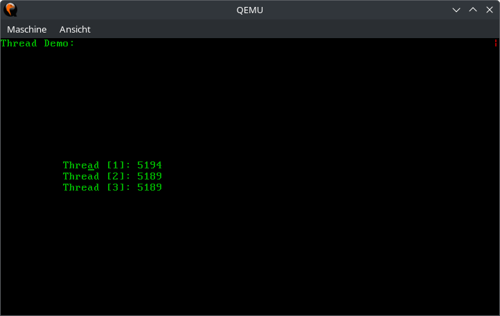

# Aufgabe 5: Preemptives Multithreading

## Lernziele
1. Tieferes Verständnis von präemptiven Multitasking
2. CPU-Entzug mithilfe des PIT
3. Synchronisierung des Schedulers und des Allokators gegenüber dem PIT-Interrupt

## A5.1: Programmable Interval Timer (PIT)
Der PIT wird ab sofort verwendet, um eine Systemzeit sowie ein erzwungenes Umschalten zwischen Threads zu realisieren. Die Systemzeit wird in der Variable 
`SYSTEM_TIME` (in `pit.rs`) gespeichert und diese soll bei jedem Interrupt für den PIT inkrementiert werden.
Verwenden Sie hierfür im PIT den Zähler 0 und Modus 3 und laden Sie den Zähler mit einem passenden Wert, sodass der PIT jede Millisekunde ein Interrupt ausgelöst.
Jeder Interrupt verursacht also eine Inkrementierung und entspricht einem Tick (1ms). Somit zeigt `SYSTEM_TIME` an, wie viele Ticks seit dem Beginn der Zeiterfassung vergangen sind. 

Im Interrupt-Handler des PITs soll die Systemzeit in Form eines rotierenden Zeichens (engl. spinner) an einer festen Stelle dargestellt werden. Verwenden Sie hierfür beispielsweise die rechte obere Ecke und folgende Zeichen: `| / - \` (vorgegeben in `SPINNER_CHARS`), wobei das Zeichen in einem festen Intervall (z.B. alle 250ms) gewechselt werden soll. Hierzu muss in `trigger()` die `CGA` Instanz gelockt werden. Sollte das Lock gerade nicht verfügbar sein, würde dies zu einem Deadlock führen, da wir nie aus dem Interrupt Handler zurückkehren würden. Verwenden Sie `try_lock()` um dies zu vermeiden. Sollte das Lock nicht verfügbar sein, wird das Zeichen einfach nicht ausgegeben. Früher oder später wird das Lock mal frei sein und das Zeichen aktualisiert werden.

Die Funktion `plugin()` soll den den PIT mit Hilfe von `TIMER.call_once(|| { ... })` initialisieren, das Interrupt Intervall setzen und ihn in `intdispatcher.rs` anmelden. Außerdem sollen die Timer Interrupts im PIC zugelassen werden. Rufen Sie `plugin()` in `startup.rs` auf, um den Timer zu starten.

In folgenden Dateien muss Code implementiert werden: `devices/pit.rs` und `startup.rs`.

## A5.2: Umbau des Treibers für den PC-Lautsprecher
Die `delay()` Funktion im Treiber für den PC-Lautsprecher hat bisher den PIT direkt programmiert und dafür den Zähler 0 verwendet. Das geht nun nicht mehr, da Zähler 0 nun anderweitig benötigt wird, siehe A5.1.
Daher sollen alle `delay()` Aufrufe durch `pit::wait()` ersetzt werden.
Die Funktion `pit::wait()` soll in einer Dauerschleife die `SYSTEM_TIME` abfragen, bis eine gegebene Anzahl an Millisekunden vergangen ist.

Testen Sie den Umbau mit einer der Melodien.

In folgenden Dateien muss Code implementiert werden: `devices/pcspk.rs`, `devices/pit.rs`.

## A5.3 Umbau des Interrupt-Dispatchers in Rust
Der Interrupt-Dispatcher in Rust in der Datei `intdispatcher.rs` muss angepasst werden. Der Zugriff auf die globale Variable `INT_VECTORS` ist durch einen Mutex geschützt. Dies wird nun zum Problem, da wir aus der ISR des PITs einen Thread-Wechsel durchführen möchten. Dabei kehren wir vorerst nicht aus der ISR zurück, weswegen der Mutex auf `INT_VECTORS` nicht freigegeben würde. Das wiederum führt dazu, dass beim nächsten Interrupt eine Verklemmung eintritt. Um dieses Problem zu beheben, rufen wir in `pit::trigger()` vor jeder Thread-Umschaltung `intdispatcher::INT_VECTORS.force_unlock()` auf um das Lock mit Gewalt freizugeben.

Damit durch `force_unlock()` zu keiner Race Condition kommen kann, müssen in Ihrer Funktion `intdispatcher::register()` kurz die Interrupts gesperrt werden, wenn eine neue ISR registriert wird. Verwenden Sie hierfür die Funktionen `cpu::disable_int_nested()` und `cpu::enable_int_nested(param)`.

In folgender Datei muss Code implementiert werden: `kernel/interrupts/intdispatcher.rs`.

## A5.4 Threadumschaltung mithilfe des PIT
Nun soll die erzwungene Thread-Umschaltung aus der ISR des PITs realisiert werden. Fügen Sie dem Struct `SchedulerState` in `scheduler.rs` eine boolean Variable `initialized` hinzu. Diese soll anfangs auf `false` gesetzt sein, und in `Scheduler::scheduler()` auf `true` umgesetzt werden, direkt bevor der erste Thread gestartet wird.

In `yield_cpu()` soll nun mit der Variable `initialized` geprüft werden, ob der Scheduler bereits läuft und nur dann eine Thread-Umschaltung eingeleitet werden. Außerdem müssen wir auch hier sichergehen, dass wir kein Deadlock erzeugen, wenn wir `Scheduler::state` locken. Eine Thread-Umschaltung soll nur erfolgen, wenn das Lock mit `try_lock()` geholt werden kann.

In folgender Datei muss Code implementiert werden: `kernel/threads/scheduler.rs`.

## A5.5: Testanwendung mit Multithreading
Testen Sie das präemptive Multitasking mit Ihrer Zähler-Demo aus Aufgabe 4. Entfernen Sie jedoch den `yield_cpu()` Aufruf, da wir jetzt ja den Entzug der CPU überprüfen wollen. Zusätzlich soll noch ein weiterer Thread erzeugt werden der eine Melodie abspielt. Neben diesen beiden Threads soll zusätzlich der Fortschritt der Systemzeit im Interrupt ausgegeben werden, siehe nachstehende Abbildung (rechts oben).

Vermutlich werden Sie nun ein paar unerwartete Dinge feststellen:
 1. Hauptsächlich gibt nur der erste Thread seinen Zähler aus. Die anderen beiden kommen, wenn überhaupt, nur selten zum Zug.
 2. Sollte doch mal einer der anderen beiden Threads rechnen, kann es passieren, dass die Ausgabe mit `println!()` an der falschen Position auf dem Bildschirm geschieht.

Das erste Problem kommt daher, dass der erste Thread die meiste Zeit über das CGA-Lock hält. Er holt es einmal zum Setzen der Cursor-Position und einmal in `println!()`. Es gibt nur ein sehr kleines Zeitfenster, in dem das CGA-Lock frei ist. Nur wenn der PIT zufällig in diesem Zeitfenster eine Thread-Umschaltung veranlasst, kann einer der anderen Threads seinen Zähler ausgeben. Das passiert jedoch nur selten, so dass die anderen beiden Threads "verhungern". Bauen Sie testweise ein `pit::wait(100)` nach der Ausgabe ein, und es müssten nun alle drei Threads ihre Zähler ausgeben, da nun die Wahrscheinlichkeit, dass ein Thread-Wechsel stattfindet, während das CGA-Lock frei ist deutlich gesteigert wurde. Das ist jedoch eine sehr unschöne Lösung, da viel Rechenzeit verschwendet wird. Sinnvoller wäre es stattdessen, wenn ein Thread nach einer gewissen Anzahl an Schleifendurchläufen (z.B. 10) auch mal freiwillig die CPU abgibt.

Das zweite Problem entsteht, weil wir das CGA-Lock einmal holen um die Cursor-Position zu setzen. Anschließend wird es freigegeben und dann wieder von `println!()` geholt. Sollte eine Thread-Umschaltung genau dazwischen passieren, kommt es zu Inkonsistenzen bei der Cursor-Position: Ein Thread setzt den Cursor z.B. auf (10, 10), dann wird ihm die CPU entzogen und ein anderer Thread setzt den Cursor auf (10, 20) um dort seine Ausgabe zu machen. Wenn nun wieder der ursprüngliche Thread dran kommt, geht er davon aus, dass der Cursor weiterhin bei Position (10, 10) steht, was aber nicht mehr stimmt und die Ausgabe erfolgt an der falschen Position auf dem Bildschirm.
Um dieses Problem zu lösen wurden in `cga_print.rs` die zusätzlichen Makros `cga_print!()` und `cga_println!()` eingeführt. Diese funktionieren analog zu `print!()` und `println!()`, bekommen aber als ersten Parameter zusätzlich eine CGA-Referenz. Auf diese Weise können wir erst das CGA-Lock holen (`let mut cga = CGA.lock()`), dann die Cursor-Position setzen und schließlich mit der gelockten Referenz und `cga_println!()` unsere Ausgabe machen (z.B. `cga_println!(&cga, "Hello!")`);
Übernehmen Sie hierzu die `cga_print.rs` aus der Vorgabe und bauen die Änderungen in `cga.rs` in ihr System ein.

**Beispielausgabe des Testprogramms**

