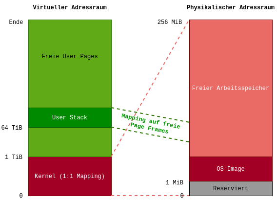

# Aufgabe 11: Paging (Isolation und Schutz - Aufgabe 4)

## Lernziele
1. Eine grundlegende Paging-Funktionalität implementieren.
2. Threads in eigenen Adressräumen mit isolierten User Stacks starten.

## A11.1: Seitentabellen für den Kernel
Wir verwenden ein vier-stufiges Paging mit ausschließlich 4 KiB Seiten (keine 2 MiB Seiten). Der gesamte physikalische Adressraum soll im Kernel 1:1 gemappt werden. Dadurch kann der Kernel immer alle physikalischen Adressen zugreifen. Dafür müssen wir zunächst die höchste physikalische Adresse ermitteln. In der Vorgabe wird der `PfListAllocator` in `frames.rs` um eine neue Variable `max_addr` erweitert. Passen Sie Ihre `free_block()`-Methode so an, dass sie bei jedem eingefügten Block prüft, ob seine Endaddresse größer ist als `max_addr` und `max_addr` entsprechend aktualisiert.

Nun soll in `pages.rs` die Funktion `PageTable::map(&mut self, virt_addr: u64, num_pages: usize, kernel: bool)` implementiert werden, die physikalischen Speicher in einen Addressraum einblendet (es empfiehlt sich eine rekursive Lösung). Ist der Parameter `kernel` auf `true` gesetzt, soll ein 1:1-Mapping erstellt werden. Die gegebene Addresse `virt_addr` ist also gleich der physikalischen Adresse, die auf der untersten Ebene in die Page Tables eingetragen wird. Für die Seitentabellen müssen dabei Page Frames alloziert werden, aber auf der untersten Ebene nicht, da hier der bestehende physikalische Speicher nur „gemappt“ wird. Der Fall, dass `kernel` auf `false` gesetzt ist, wird erst in Aufgabe 11.2 relevant.

Bezüglich der Seitentabelleneinträge lassen wir vorerst alle Einträge im Ring 3 zugreifbar, löschen also nicht das User-Bit. Das ist noch notwendig, damit wir den Code im Ring 3 ausführen können, wird aber in einem späteren Übungsblatt abgeschafft. Zudem setzen wir alle Seiten auf schreibbar und sofern mit Page-Frames unterlegt auf „Präsent“. Um andere mögliche Bits in den Seitentabellen­einträgen, wie Caching, No-Execute, Protection Keys, etc. kümmern wir uns nicht.

Die erste Seite (Adresse 0) sollte auf nicht-Präsent gesetzt werden, um Nullpointer-Zugriffe abfangen und er­kennen zu können.

Die Funktion `init_kernel_tables()` nutzt `PageTable::map()` um ein Kernel Mapping in einem Adressraum einzurichten. Testen Sie Ihre Implementierung zunächst ohne User Threads und Interrupts, indem Sie `init_kernel_tables()` in `startup.rs` aufrufen und den Rückgabewert in das CR3-Register schreiben. Dadurch wird der neu erstellte Adressraum geladen. Wenn etwas beim Anlegen der Page Tables nicht passt, wird Ihr System hier sehr wahrscheinlich abstürzen. Es empfiehlt sich dann, das System mit einem Debugger vor dem Setzen des CR3-Registers anzuhalten, und sich die Page Tables im Speicher anzuschauen.

Wenn das funktioniert sollte der Nullpointer-Zugriff geprüft werden. Es sollte ein Page-Fault auf­treten (Interrupt 14) und die Adresse der Instruktion die den Page-Fault ausgelöst hat steht in CR2. Schreiben Sie einen Page Fault Handler, der die Adresse ausliest und sie in einer Panic ausgibt. Sie müssen Ihren Handler in `idt.rs` an der richtigen Stelle in die IDT eintragen.

Sofern der Kernel weiterhin funktioniert, können wieder die Interrupts aktiviert werden sowie unsere bestehenden User Threads ge­testet werden.

*Wichtige Information für diese Aufgabe finden Sie in Intel Software Developer’s Manual Volume 3 in Kapitel 5.5 4-Level Paging and 5-Level Paging.*

## A11.2: Seitentabellen für User Threads
Nun soll eine erste Isolation der Threads im User-Mode erfolgen, zunächst nur für die Stacks. Der Stack jedes User-Mode Threads soll an einem gegebenen virtuellen Adressbereich liegen (ab 64 TiB) (siehe `consts.rs`). Der User-Stack soll also nicht mehr über den globalen Heap-Allokator alloziert werden. Damit dieser Adressbereich genutzt werden kann muss ein Mapping in den Seitentabellen eingerichtet werden. Hierfür muss in `pages.rs` die Funktion `map_user_stack()` implementiert werden, welche in `threads.rs` für das Allozieren des User-Stacks verwendet werden soll. Die Funktion `PageTable::map()` muss dafür auch mit dem Parameter `kernel = false` umgehen können. Dabei soll auf der untersten Ebene nicht mehr ein 1:1 Mapping wie beim Kernel eingerichtet werden, sondern jeweils ein Page Frame mit Hilfe des Frame Allokators alloziert und eingeblendet werden.

Der User-Stack kann im `Thread`-Struct weiterhin als `Vec` angelegt werden, obwohl er nicht mehr dynamisch auf dem Heap alloziert wird, sonder die (virtuelle) Adresse jetzt fest ist. Hierzu kann die Rust-Funktion `Vec::from_raw_parts()` verwendet werden, welche einen neuen `Vec` mit einer gegebenen Adresse, Kapazität und Größe initialisiert. *ACHTUNG:* Diese Funktion sollte generell nur mit Vorsicht eingesetzt werden, da der `Vec` seinen Speicher auf dem Kernel-Heap freigeben möchte, wenn er gedropped wird.

Der Kernel-Stack eines jeden Threads soll weiterhin über den Heap-Allokator angelegt werden. Jeder Thread bekommt so einen eigenen Addressraum, welchen wir bei der Erstellung eines Threads mit `pages::init_kernel_tables()` anlegen können. Der Kernel ist dadurch in jeden Addressraum eingeblendet und bleibt durch die bisher verwendeten Page Table Flags auch vom User Mode aus ausführbar. Das ändert sich in den kommenden Ausbaustufen des Systems.

Die Adresse der Page Map Level 4 (PML4), welche von `pages::init_kernel_tables()` zurückgegeben wird, muss außerdem im `Thread`-Struct gespeichert werden. In `Thread::start()` und `thread_switch()` muss nun bei jedem Thread-Wechsel auch in den Adressraum des nächsten Threads gewechselt werden. Hierzu bekommt `thread_switch()` einen weiteren Parameter `next_pml4`.

Testen Sie diese Aufgabe mit zwei User-Threads, beispielweise Threads die einen Zähler ausgeben. Prüfen Sie auch mit dem Debugger, dass die Stacks wirklich alle an der gleichen virtuellen Adresse beginnen und die Isolation funktioniert!

*Abschließende Bemerkungen*
 - *Die Isolation des Codes folgt später. Wir haben zwar bereits eine Systemaufrufsschnittstelle, können aber daran vorbei noch beliebige Funktionen des Kernels aufrufen.*
 - *Auch die Isolation des Heaps folgt später. Wir verwenden also vorerst unseren globalen Allokator für jeden User-Level Thread, welcher noch Speicher im Kernel-Space verwendet.*
 - *Beides funktioniert noch, da wir die die Seiten für den Kernel noch nicht geschützt haben.*
