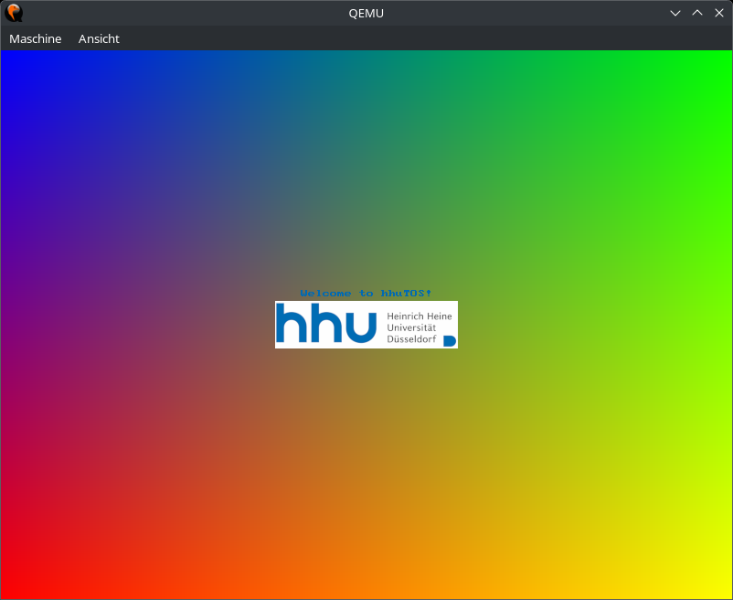

# Aufgabe 7: Eine eigene BS-Erweiterung / Anwendung

## Lernziele
1. Eine Anwendung schreiben
2. Alternativ eine Betriebssystem-Komponente entwickeln

## Mögliche Themenrichtungen
- Grafikdemo (multithreaded)
- Retro-Spiel (z.B. Snake, Pacman, ...)
- einfache Shell (Beispiele für Befehle: clear, time, meminfo, ...) 
- Scheduler mit Prioriäten (mit einer Demo)

## Vorgabe
Die Vorgabe umfasst einige Dateien, um einen Grafikmodus nutzen zu können. Außerdem enthält sie Code, mit dem der PCI-Bus nach Geräten gescannt wird.

### Grafikfunktionen 
Vorhanden sind nur sehr grundlegende Grafik-Funktionen, inkl. einer Text-Ausgabe mit einer Schriftart. Weitere Funktionen sollen je nach Anwendung ergänzt werden. 

Ob das System im Grafik- oder Textmodus startet wird in `boot/boot.asm`durch die die Konstante `TEXT_MODE` festgelegt. Wenn diese Konstante aukommentiert wird, so schaltet `grub` direkt in den Grafikmodus (800x600 mit 32 Bit pro Pixel). Eine alternative Grafikauflösung kann durch die Konstanten `MULTIBOOT_GRAPHICS_*` in  `boot/boot.asm` eingestellt werden. Mögliche Auflösungen sollten sich an dem VESA-Standard orientieren, siehe hier: [VESA](https://en.wikipedia.org/wiki/VESA_BIOS_Extensions). Es sollte immer ein Modus mit 4 Byte pro Pixel als Farbtiefe verwendet werden.

Da jeder Pixel von der CPU einzeln im Grafikspeicher gesetzt werden muss, kann das Zeichnen komplexer Szenen schnell langsam werden. Eine deutliche Performance-Steigerung erhält man mit einem Release-Build, bei dem Compiler-Optimierungen aktiviert sind. Allerdings kann dann nicht mehr debuggt werden. Einen solchen Build erstellt man mit dem folgenden Befehl:
```bash
cargo make --profile production qemu
```

Die Textausgabe über CGA funktioniert nicht im Grafikmodus! Ein Beispiel für die Textausgabe befindet sich in der Vorgabe in `user/aufgabe7/graphic_demo.rs`, siehe auch nachstehendes Bild.

Folgende Dateien sind für die Grafik-Unterstützung in der Vorgabe:
- `startup.rs`: Bekommt jetzt eine Mutltiboot-Referenz als Parameter
- `devices/lfb.rs`: Zeichenfunktionen im Grafikmodus
- `devices/font_8x8.rs`: Bitmap-Font für die Textausgabe im Grafikmodus
- `user/aufgabe7/graphic_demo.rs`: Kleine Grafikdemo (siehe Bild unten)
- `user/aufgabe7/bmp_hhu.rs`: HHU-Logo als Bitmap
- `cbmp2rs.c`: Kleines C-Programm zum Konvertieren von Bildern, gespeichert von GIMP als C-Source, siehe auch `Graphics-Rust.pdf`.

**Beispielausgabe der Grafikdemo**



### PCI
Mit dem Quellcode in `devices/pci.rs` kann der PCI-Bus nach vorhandenen Geräten abgesucht werden. In `startup.rs` ist ein kleines Beispiel, welches nach einer Realtek RTL8139 Netzwerkkarte sucht und deren MAC-Adresse ausliest. Dies ist nur als kleine Demo gedacht, für diejenigen, die sich für Treiber-Programmierung interessieren und auch mal mit komplexeren Geräten als z.B. dem PIT arbeiten möchten. So etwas wäre auch als Abgabe denkbar. Dann muss allerdings je nach ausgesuchter Hardware kein voll funktionsfähiger Treiber implementiert werden, da dies den Aufwand der Aufgabe übersteigen würde. Gut dokumentierte PCI-Geräte sind z.B. die Realtek RTL8139 Netzwerkkarte oder ein IDE Festplatten Controller. Dazu findet man auch Artikel im OSDev-Wiki.

Wenn die Vorgabe richtig eingebaut wurde, sollten beim Booten folgenden Meldungen über die serielle Schnittstelle ausgegeben werden:

```
Scanning PCI bus
Found PCI device 8086:1237
Found PCI device 8086:7000
Found PCI device 8086:7010
Found PCI device 8086:7113
Found PCI device 1234:1111
Found PCI device 10ec:8139
Found Realtek RTL8139 network controller
RTL8139 I/O base address: 0xc000
MAC address: [52, 54, 0, 12, 34, 56]
```

Folgende Dateien sind für die PCI-Unterstützung in der Vorgabe:
- `Makefile.toml`: Enthält kleine Änderungen um QEMU mit einer emulierten einer Realtek RTL8139 Netzwerkkarte zu starten
- `startup.rs`: Sucht den PCI-Bus nach einer Realtek RTL8139 Netzwerkkarte ab
- `devices/pci.rs`: Treiber für den PCI-Bus
