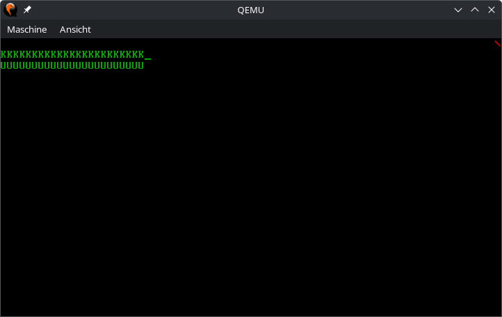
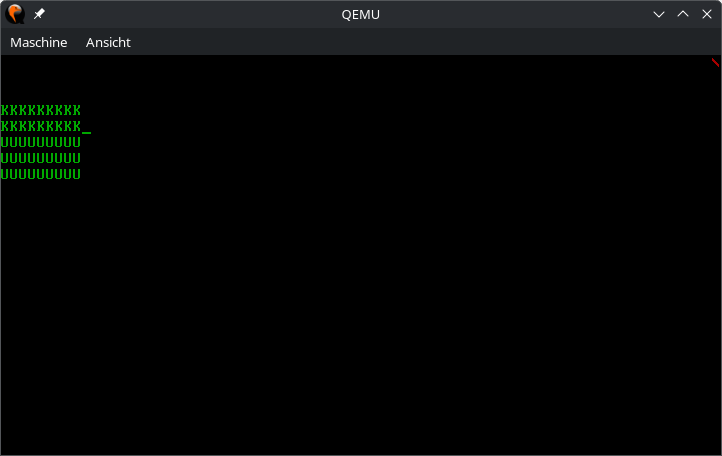

# Aufgabe 8: User Mode Threads (Isolation und Schutz - Aufgabe 1)

Dies ist die erste Aufgabe des zweiten Masterkurses zum Thema "Betriebssystementwicklung". Falls Sie den ersten Kurs bereits gehört haben, können Sie Ihr vorhandenes Betriebssystem weiter entwickeln. Sollten Sie in diesem Kurs neu dazu gekommen sein, oder generell lieber mit einem "frischen" OS starten, finden Sie im Branch [vorgabe-8](https://github.com/hhu-bsinfo/hhuTOSr/tree/vorgabe-8) eine etwas abgespeckte Version (ohne PC Speaker, Mutex und Demos) unserer Lösung für den ersten Kurs. Diese können Sie als Basis für den Kurs "Isolation und Schutz in Betriebssystemen" verwenden.

*Achtung: Der Branch wird 14 Tage nach Beginn der Vorlesungszeit offline genommen.*

## Lernziele
1. Verstehen wie bei der x86-Architektur Anwendungscode im User Mode (Ring 3) ausgeführt wird und wie man damit verhindert, dass ein User-Thread privilegierte Instruktionen ausführt oder auf Ports zugreift.

## A8.1: Global Descriptor Table (GDT)
Zunächst benötigen wir in der vorhandenen GDT (liegt bei der Marke `_gdt`) zwei weitere Einträge: Einen für Ring 3 Code und einen für Ring 3 Daten. Das Limit der GDT muss ebenfalls angepasst werden, da wir die Anzahl der Einträge verändern. Das Limit liegt bei der Marke `_gdt_descriptor`.

Alle Arbeiten in dieser Aufgabe sind in Assembler in der Datei `boot.asm` durchzuführen.

Die Änderungen lassen sich zunächst nicht wirklich testen. Jedoch sollte das OS weiterhin ordungsgemäß booten, nachdem Sie die GDT angepasst.

*Wichtige Information für diese Aufgabe finden Sie in Intel Software Developer’s Manual Volume 3 in Kapitel 3.4.5 Segment Descriptors.*

## A8.2: Task State Segment (TSS)
Als nächstes benötigen wir ein TSS, damit der Prozessor den Kernel-Stack findet, wenn beispielweise ein Thread im Ring 3 durch einen Interrupt unterbrochen wird. Hierfür nutz der Prozessor im TSS den Eintrag `rsp0` (Stack-Zeiger für den Ring 0). In der Vorgabe befindet sich bereits ein TSS (ohne IO-Bitmap; lassen wir absichtlich weg, dadurch sind jegliche Portzugriffe im User-Mode unterbunden) an der Marke `_tss`. Da wir nur einen CPU-Kern nutzen, reicht ein einziges TSS für unser Betriebssystem. 

Damit das TSS genutzt werden kann muss ein TSS-Deskriptor (TSSD) in der GDT hinzugefügt werden. Bis auf die Basis-Adresse können alle Informationen im TSSD direkt statisch eingetragen werden. Zusätzlich muss nochmals das Limit in `_gdt_descriptor` angepasst werden (wie bei Aufgabe 1).

*Achtung: Der TSSD-Eintrag hat die doppelte Größe!*

Die Basisadresse des TSS muss zur Laufzeit mithilfe der Funktion `_tss_set_base_address()` in den TSSD eingetragen werden. Diese Funktion wird in der Vorgabe bereits an der richtigen Stelle aufgerufen (nur einmal beim Bootvorgang). Um einfach an die Basisadresse des TSSD-Eintrags zu gelangen, definieren Sie sich in der GDT vor dem TSSD-Eintrag in Assembler eine Marke (engl. Label).

Nun benötigen wir noch eine Funktion zum Setzen des Kernel-Stack-Zeigers (`rsp0`) in unserem TSS. Hierfür gibt es in der Vorgabe die Marke `_tss_set_rsp0()`. Diese Funktion wird bereits an der richtigen Stelle in der Vorgabe aufgerufen und hierbei wird als Parameter der Zeiger auf den Stack übergeben, welcher aktuell verwendet wird. Später nutzen wir diese Funktion in Rust, um bei jedem Thread-Wechsel den rsp0 (Kernel-Stack-Pointer) im TSS zu sichern.

Zuletzt muss noch das TSS-Register (TSSR) mit dem Befehl `ltr` geladen werden. Die richtige Stelle ist in `boot.asm` durch einen Kommentar markiert.

Der Speicherplatz des initialen Stacks ist an der Marke `_init_stack` definiert. Er wird aber, sobald der Scheduler läuft, nicht mehr verwendet. Alle Stacks (User- und Kernel-Mode) aller Threads liegen dann im Heap und werden mit unserem Allokator alloziert.

Alle Arbeiten in dieser Aufgabe sind in Assembler in der Datei `boot.asm` durchzuführen.

*Wichtige Information für diese Aufgabe finden Sie in Intel Software Developer’s Manual Volume 3 in Kapitel 7.2 Task Management Data Structures*

## A8.3: Threads in Ring 3 starten
User-Level-Threads (laufen im Ring 3) benötigen immer zwei Stacks, einen für den User- und einen für den Kernel-Mode. Der Einfachheit halber allozieren wir immer zwei Stacks, auch für reine Kernel-Threads. Hierfür muss die `struct Thread` in `thread.rs` angepasst werden. Außerdem soll die Funktion `new_user_thread()` einen Thread zurückgeben, bei dem die Boolean-Flag `is_kernel_thread` auf `false` gesetzt ist. Die Funktion `new()` wird in `new_kernel_thread()` umbenannt, die Funktion `kickoff()` in `kickoff_kernel_thread()`  und `prepare_stack()` in `prepare_kernel_stack()`.

Die Thread-Umschaltung ist in `thread_switch()` fertig vorgegeben. Neben dem Sichern und Wieder­her­stellen der Register muss auch der Kernel-Stack im TSS umgeschaltet werden. Dafür wird der Parameter `next_stack_end` verwendet.  Der User-Level-Stack-Zeiger muss nicht extra verwaltet werden, da er automatisch durch die Hardware bei einem Thread-Wechsel gesichert wird. Der Thread-Wechsel aus einem User-Thread erfolgt nur aus dem Timer-Interrupt heraus und dafür wechselt der Prozessor automatisch von Ring 3 nach Ring 0 und sichert den Stack-Zeiger des unterbrochenen User-Level Threads auf dem Kernel-Stack.

*Achtung: Das heißt, User-Threads dürfen aktuell nicht `Scheduler::yield_cpu()` und `Scheduler::exit()` aufrufen. Daher kann auch `pit::wait()` noch nicht im User Mode verwendet werden. Außerdem klappt auch unser Mutex aus Aufgabe 6 nicht im User Mode. Sollten Sie mit Ihrem Betriebssystem aus dem ersten Kurs weiterarbeiten, müssen Sie für die CGA-Instanz wieder ein klassisches Spinlock verwenden, statt unseres Mutex mit Warteschlange.*

Der vorhandene Thread-Start mithilfe von `prepare_kernel_stack()` und `start()` bleibt un­ver­ändert. Damit startet jeder Thread zunächst immer im Ring 0. In `kickoff_kernel_thread()` muss der Kernel-Stack im TSS gesetzt werden, mithilfe der Funktion _tss_set_rsp0.

Als nächstes muss die Funktion `switch_to_usermode()` in thread.rs implementiert werden. Sie soll die Assembler-Funktion `thread_user_start()` verwenden, um mit `iretq` einen Ring-Wechsel durchzuführen (anders geht das nicht). In `switch_to_usermode()` muss ein Stackframe gebaut werden, wie er bei einem Interrupt mit Privilegienwechsel vorliegt. Für SS und CS sind die ent­sprechenden User-Mode-Einträge in der GDT zu verwenden (siehe Aufgabe 1).

*Achtung: für die Stack­einträge CS und SS muss RPL = 3 gesetzt werden! Und der Stackframe darf keinen Error-Code beinhalten.*

Hierdurch sollten wir dann in `kickoff_user_thread()` „landen“ und der Prozessor sollte dann in Ring 3 sein.

Am besten sollte das Umschalten in den Ring 3 vorerst nur mit einem Thread getestet werden, beispielsweise dem Idle-Thread, also versuchen den Idle-Thread im Ring 3 laufen zu lassen. Später soll der Idle-Thread natürlich im Ring 0 ausgeführt werden.

Hinweis: wie kann man erkennen, ob man im User-Mode ist?
 - Einen Port-Befehl ausführen, dieser sollte eine General Protection Fault (GPF) auslösen.
 - Oder mit dem Debugger einen Breakpoint auf `kickoff_user_thread()` setzen und prüfen, ob RPL = 3 im CS-Register steht.

Alle Arbeiten in dieser Aufgabe sind in Rust in der Datei `thread.rs` durchzuführen.

### Testszenario
In der Datei `user/aufgabe8/user_threads.rs` finden Sie bereits ein fertiges Testprogramm, welches einen Kernel- und einen User-Thread startet. Jeder Thread füllt eine eigene Zeile auf dem Bildschirm nach und nach mit dem Buchstaben `K` oder `U`. Für ein erweitertes Testszenario können Sie mehrer User-Threads starten. Prüfen Sie außerdem mit dem Debugger ob der Kernel-Thread auch nach mehreren Schleifendurchläufen noch in Ring 0 und der User-Thread in Ring 3 läuft (ablesbar am CS-Register).

|  |
|:--:|
| *Ein Kernel- und ein User-Thread* |

|  |
|:--:|
| *Zwei Kernel- und drei User-Threads* |
