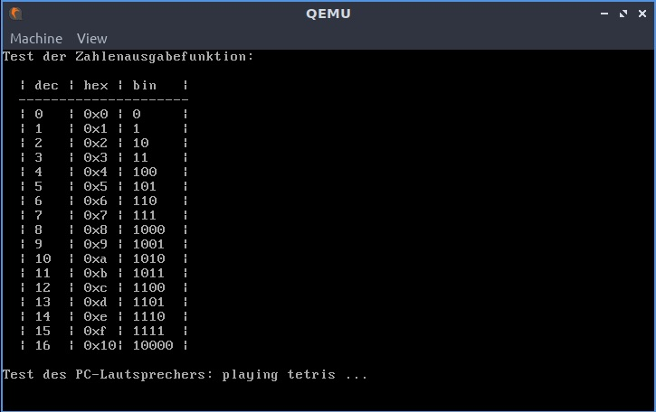

# Aufgabe 1: Ein-/Ausgabe

Der Quellcode zum Betriebssystem befindet sich im Unterordner [os](os/). Dort finden Sie auch eine README-Datei mit Anleitungen zum Kompilieren und Starten von hhuTOS.

## Lernziele
1. Kennenlernen der Entwicklungsumgebung
2. Einarbeiten in die Programmiersprache Rust
3. Hardwarenahe Programmierung: CGA-Bildschirm und Tastatur

## A1.1: CGA-Bildschirm
Für Testausgaben und zur Erleichterung der Fehlersuche soll das Betriebssystem zunächst Ausgabefunktionen für den Textbildschirm erhalten. Die Funktionsfähigkeit soll mit Hilfe eines aussagefähigen Testprogramms gezeigt werden, siehe Bildschirmfoto unten.

Dazu soll in `startup.rs` in der Einstiegsfunktion `startup` die Makros `print!` und `println!` für verschieden formatierte Ausgaben, wie in Rust üblich, genutzt werden. Damit die Ausgabe-Makros in allen Modulen funktionieren wurde in `cga_print.rs` ein globaler statischer `Writer`
definiert. Dieser wird in den vorgegebenen Makros automatisch benutzt.

In folgenden Dateien müssen Quelltexte einfügt werden: `startup.rs`, `user/text_demo.rs` und
`devices/cga.rs`

*Beachten Sie die Kommentare im Quelltext der Vorgabe, sowie die Datei* `CGA-slides.pdf`

### Beispielausgaben

## A1.2: Tastatur
Damit eine Interaktion mit dem Betriebssystem möglich wird benötigen wir einen Tastatur-Treiber. In dieser Aufgabe verwenden wir die Tastatur ohne Interrupts. In main soll die Tastatur in einer Endlos-Schleife abgefragt werden und die Eingaben auf dem CGA-Bildschirm zur Kontrolle ausgegeben werden. 

Beginnen Sie mit der Funktion `key_hit`:
- Prüfen Sie zunächst in einer Schleife, ob ein Datenbyte von der Tastatur vorliegt. Hierzu muss im Control-Port geprüft werden, ob das Bit `OUTB` gesetzt ist.
- Lesen Sie anschließend das Datenbyte über den Daten-Port ein und speichern Sie das gelesene Byte in der gegebenen Variable code.
- Verwenden Sie die vorgegeben Funktion `key_decoded` um jeweils ein gelesenes Datenbyte zu übersetzen. Jedoch müssen Sie zuvor prüfen, ob das Datenbyte nicht von einer PS/2 Maus stammt. Dies wird über das Bit `AUXB` im Control-Register angezeigt. Beim Aufruf von `key_decoded` müssen Sie das das Datenbyte nicht übergeben, dies ist bereits in der Variablen `code` gespeichert.
- Wenn `key_decoded` true zurückgibt wurde eine Taste komplett dekodiert und in der Variablen `gather` gespeichert. Geben Sie in diesem Fall `gather` (Typ `Key`) zurück oder ansonsten `invalid`. 

Danach können folgende Funktionen implementiert werden: `set_repeate_rate` und `set_led`. Beide Funktion können, müssen aber nicht implementiert werden.

Namen von benötigten Variablen und Konstanten:
- Control-Port: `KBD_CTRL_PORT`
- Daten-Port: `KBD_DATA_PORT`
- OUTB: `KBD_OUTB`
- AUXB: `KBD_AUXB`

Die Befehle für die Implementierung von `set_led` finden Sie in `keyboard.rs`. Warten und prüfen Sie nach dem Absenden eines Befehls die Antwort auf `KBD_REPLY_ACK`. 
Die Tabellen für die Abbildung von Scan-Codes auf ASCII-Codes unterstützen derzeit keine Umlaute.

In folgenden Dateien müssen Quelltexte einfügt werden: `user/keyboard_demo.rs` und
`devices/keyboard.rs`.

*Achtung:
Die Methoden zur Ansteuerung der LEDs und der Tastaturwiederholrate funktionieren nur richtig auf echter Hardware.*

*Beachten Sie die Kommentare im Quelltext der Vorgabe, sowie die Datei* `KBD-slides.pdf`.
