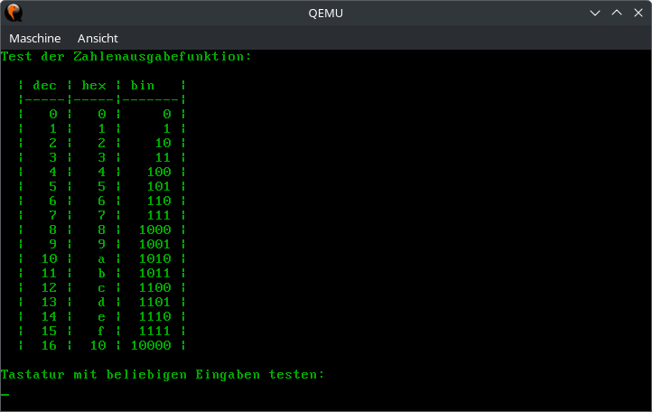

# Aufgabe 1: Ein-/Ausgabe

Der Quellcode zum Betriebssystem befindet sich im Unterordner [os](os/). Dort finden Sie auch eine README-Datei mit Anleitungen zum Kompilieren und Starten von hhuTOS.

## Lernziele
1. Kennenlernen der Entwicklungsumgebung
2. Einarbeiten in die Programmiersprache Rust
3. Hardwarenahe Programmierung: CGA-Bildschirm und Tastatur


## A1.1: CGA-Bildschirm
Für Testausgaben und zur Erleichterung der Fehlersuche soll das Betriebssystem zunächst Ausgabefunktionen für den Textbildschirm erhalten. Die Funktionsfähigkeit soll mit Hilfe eines aussagefähigen Testprogramms gezeigt werden, siehe Bildschirmfoto unten.

Dazu soll in `startup.rs` in der Einstiegsfunktion `startup` die Makros `print!` und `println!` für verschieden formatierte Ausgaben, wie in Rust üblich, genutzt werden. Diese greifen auf die globale statische Variable `CGA` aus `devices/cga.rs` zu, um Ausgaben auf dem Bildschirm zu machen.

*ACHTUNG:* Der Rust-Compiler garantiert, dass es auf jede Variable zu jeder Zeit immer nur eine mutable Referenz geben kann. In unserem konkreten Fall bedeutet das, dass nicht zwei Threads gleichzeitig mit der CGA-Instanz Bildschirmausgaben machen können. Wir haben zwar noch überhaupt keine Nebenläufigkeit im System (weder durch Interrupts, noch durch Threads), aber das weiß der Compiler ja nicht. Deshalb ist die globale CGA-Instanz durch einen Mutex geschützt, der bei jedem Zugriff gesperrt werden muss. Die Makros `print!` und `println!` machen das automatisch und transparent für uns. Das birgt allerdings auch Gefahren. Betrachten wir einmal folgenden Code-Schnipsel:

```Rust
let mut cga = CGA.lock(); // Globale CGA-Instanz sperren -> Wir können dann auf `cga` verschiedene Methoden aufrufen
cga.clear(); // Den Bilschrim leeren
cga.setpos(10, 10) // Den Cursor auf Position (10, 10) setzen
println!("Welcome to hhuTOS!") // An Position (10, 10) einen String ausgeben -> Klappt nicht, da die CGA-Instanz noch gesperrt ist
```

Hier wird zunächst die globale CGA-Instanz gesperrt, woraufhin wir mit der Referenz `cga` auf unseren CGA-Treiber zugreifen können. Anschließend wird der Bildschirm geleert und der Cursor an eine bestimmte Position gesetzt. Nun soll ein String ausgegeben werden, allerdings ist die CGA-Instanz noch gesperrt, weshalb der Aufruf niemals zurückkehrt und das System hängen bleibt. Es gibt verschiedene Möglichkeiten, dies zu vermeiden (wie Sie genau vorgehen, bleibt Ihnen überlassen):

1. Statt die Sperre zu halten, kann die CGA-Instanz auch nur temporär für einen einzelnen Aufruf gesperrt werden. Das ist zwar einfach, sieht jedoch unschön aus. Außerdem ist das auch nicht optimal für Nebenläufigkeit, da zwischen jedem CGA-Aufruf die CPU entzogen werden kann (ab Blatt 5). So wäre es z.B. möglich, das wir den Cursor an eine bestimmte Position setzen und dann ein anderer Thread dran kommt, welcher den Cursor ebenfalls umsetzt. Unsere Ausgabe würde dann an der falschen Position erfolgen. Während des Startup-Codes und unseren aktuellen Demos, ist dieses Vorgehen jedoch in Ordnung, da es dort keine Nebenläufigkeit gibt. Der obige Code sähe dann folgendermaßen aus:

```Rust
CGA.lock().clear(); // Den Bilschrim leeren
CGA.lock().setpos(10, 10) // Den Cursor auf Position (10, 10) setzen
println!("Welcome to hhuTOS!") // An Position (10, 10) einen String ausgeben.
```

2. Wir könnten die Sperre vor dem Aufruf von `println!` wieder freigeben. Das ändert zwar nichts daran, dass der Code nicht wirklich für Nebenläufigkeit geeignet ist, ist aber weniger umständlich, als die CGA-Instanz bei jedem Methodenaufruf zu sperren. Hierzu öffnen wir ein neuese Scope in unserem Code, in derm wir die CGA-Instanz sperren, den Bildschirm leeren und den Cursor setzen. Danach schließen wir das Scope, wodurch die Sperre automatisch freigegeben wird und rufen anschließend `println!` auf.

```Rust
{ // Neues Scope öffnen -> `cga` ist nur innerhalb des Scopes gültig
    let mut cga = CGA.lock(); // Globale CGA-Instanz sperren -> Wir können dann auf `cga` verschiedene Methoden aufrufen
    cga.clear(); // Den Bilschrim leeren
    cga.setpos(10, 10) // Den Cursor auf Position (10, 10) setzen
} // Scope verlassen -> Die Sperre wird automatisch freigegeben
println!("Welcome to hhuTOS!") // An Position (10, 10) einen String ausgeben.
```

3. Statt `print!` und `println!` können die Makros `print_cga!` und `println_cga!` verwendet werden, welche die globale CGA-Instanz nicht sperren, sondern stattdessen eine CGA-Referenz als ersten Parameter nehmen. Der obige Code sähe dann folgendermaßen aus:

```Rust
let mut cga = CGA.lock(); // Globale CGA-Instanz sperren -> Wir können dann auf `cga` verschiedene Methoden aufrufen
cga.clear(); // Den Bilschrim leeren
cga.setpos(10, 10) // Den Cursor auf Position (10, 10) setzen
println_cga!(&mut cga, "Welcome to hhuTOS!") // An Position (10, 10) einen String ausgeben.
```

In folgenden Dateien müssen Quelltexte einfügt werden: `startup.rs`, `user/text_demo.rs` und
`devices/cga.rs`

*Beachten Sie die Kommentare im Quelltext der Vorgabe, sowie die Datei* `CGA-slides.pdf`

### Beispielausgaben




## A1.2: Tastatur
Damit eine Interaktion mit dem Betriebssystem möglich wird benötigen wir einen Tastatur-Treiber. In dieser Aufgabe verwenden wir die Tastatur ohne Interrupts. In main soll die Tastatur in einer Endlos-Schleife abgefragt werden und die Eingaben auf dem CGA-Bildschirm zur Kontrolle ausgegeben werden. 

Beginnen Sie mit der Funktion `key_hit`:
- Prüfen Sie zunächst in einer Schleife, ob ein Datenbyte von der Tastatur vorliegt. Hierzu muss im Control-Port geprüft werden, ob das Bit `OUTB` gesetzt ist.
- Lesen Sie anschließend das Datenbyte über den Daten-Port ein und speichern Sie das gelesene Byte in der gegebenen Variable code.
- Verwenden Sie die vorgegeben Funktion `key_decoded` um jeweils ein gelesenes Datenbyte zu übersetzen. Jedoch müssen Sie zuvor prüfen, ob das Datenbyte nicht von einer PS/2 Maus stammt. Dies wird über das Bit `AUXB` im Control-Register angezeigt. Beim Aufruf von `key_decoded` müssen Sie das das Datenbyte nicht übergeben, dies ist bereits in der Variablen `code` gespeichert.
- Wenn `key_decoded` true zurückgibt wurde eine Taste komplett dekodiert und in der Variablen `gather` gespeichert. Geben Sie in diesem Fall `gather` (Typ `Key`) zurück oder ansonsten `invalid`. 

Danach können folgende Funktionen implementiert werden: `set_repeate_rate` und `set_led`. Beide Funktion können, müssen aber nicht implementiert werden.

Namen von benötigten Variablen und Konstanten:
- Control-Port: `KBD_CTRL_PORT`
- Daten-Port: `KBD_DATA_PORT`
- OUTB: `KBD_OUTB`
- AUXB: `KBD_AUXB`

Die Befehle für die Implementierung von `set_led` finden Sie in `keyboard.rs`. Warten und prüfen Sie nach dem Absenden eines Befehls die Antwort auf `KBD_REPLY_ACK`. 
Die Tabellen für die Abbildung von Scan-Codes auf ASCII-Codes unterstützen derzeit keine Umlaute.

In folgenden Dateien müssen Quelltexte einfügt werden: `user/keyboard_demo.rs` und
`devices/keyboard.rs`.

*Achtung:
Die Methoden zur Ansteuerung der LEDs und der Tastaturwiederholrate funktionieren nur richtig auf echter Hardware.*

*Beachten Sie die Kommentare im Quelltext der Vorgabe, sowie die Datei* `KBD-slides.pdf`.
