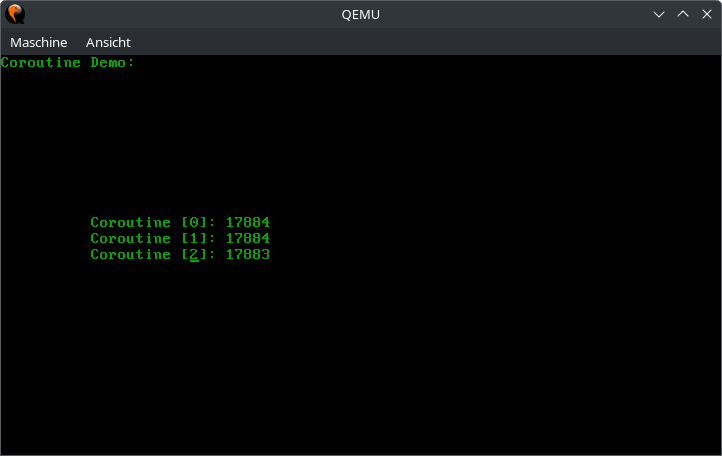
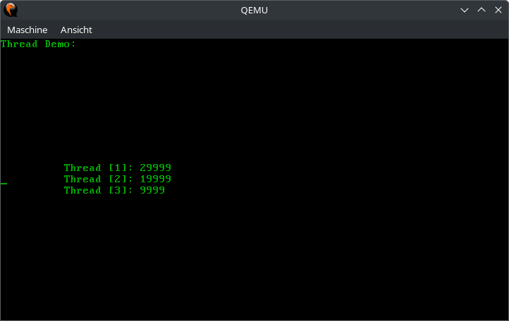

# Aufgabe 4: Koroutinen und Threads

## Lernziele
1. Auffrischen der Assemblerkenntnisse
2. Verständnis der Abläufe bei einem Koroutinen-Wechsel
3. Unterschied zwischen Threads und Koroutinen
3. Verstehen wie ein Scheduler funktioniert

FÜr diese Aufgabe sollte zuvor der Assembler-Crashkurs in `ASM-slides.pdf` gelesen werden.

## A4.1: Koroutinen
In dieser Aufgabe soll die Umschaltung zwischen Koroutinen in Assembler programmiert werden. Koroutinen sind eine Vorstufe zu Threads die später (siehe unten) zusätzlich eingeführt werden. 

Sehen Sie sich zunächst die Inhalte der neuen Dateien in der Vorgabe im Ordner `kernel/coroutines` an und implementieren Sie die beiden Assemblerfunktionen `coroutine_start()` und `coroutine_switch()` in `coroutine.rs`. Der Zustand (alle Register) einer Koroutine soll auf dem Stack gesichert werden. Das `rflags`-Register kann nicht direkt per move-Befehl zugegriffen werden, sondern nur mithilfe der Instruktionen `popf` und `pushf`. Wir nutzen `naked` Funktionen um Assembler-Code in unseren Rust-Code zu integrieren. Solche "nackten" Funktionen beinhalten ausschließlich Assmebler-Code. Es ist auch nicht möglich auf Rust-Variablen zuzugreifen. Alle Parameter müssen manuell aus den entsprechenden CPU-Registern ausgelesen werden, Alle Assembler-Befehle müssen als einzelne, durch Kommata separierte, Strings nacheinander in das `naked_asm()!` Makro eingetragen werden.

Der Zeiger auf den letzten Stack-Eintrag soll in der Instanzvariablen `stack_ptr` in der Struct `Coroutine` gespeichert werden.

Ergänzen Sie anschließend die leeren Methoden in `coroutine.rs`. Die Verkettung der Koroutinen erfolgt über `next` in der `struct Coroutine`.

Schreiben Sie für Ihre Koroutinen-Implementierung folgendes Testprogramm. Im Verzeichnis
`user/aufgabe4` der Vorgabe finden Sie hierfür Dateien. Es sollen drei Koroutinen erzeugt und zyklisch miteinander verkettet werden. Jede Koroutine soll einen Zähler hochzählen und an einer festen Position auf dem Bildschirm ausgeben und dann auf die nächste Koroutine umschalten. Durch die Verkettung werden die drei Koroutinen dann reihum abwechselnd ausgeführt, wodurch die Zähler scheinbar nebenläufig vorangetrieben werden, siehe nachstehende Abbildung. Beim Ändern der Cursor-Position müssen Sie darauf achten, dass die CGA-Instanz nur temporär zum Setzen des Cursors gelockt wird, da `println!()` die CGA-Instanz ebenfalls locken wird. Das wird bei präemptiven Multitasking ein Problem, da dann die CPU zwischen `setpos()` und `println!()` entzogen werden kann. Damit werden wir uns jedoch erst auf dem nächsten Übungsblatt beschäftigen.

In folgenden Dateien muss Code implementiert werden: `kernel/corouts/coroutine.rs`, `user/aufgabe4/coroutine_demo.rs` und `startup.rs`.

Hinweis: Schauen Sie sich vor dem Programmieren der Assemblerfunktionen nochmals die Aufrufkonvention für die Parameterübergabe an.

**Beispielausgaben der Koroutinen**

(In eckigen Klammern wird die Koroutinen-ID angezeigt.)

## A4.2: Warteschlange
Der Scheduler benötigt eine Warteschlange (engl. queue) bei der immer am Anfang einer einfach verketteten Liste ein Element entfernt wird (Thread der als nächstes die CPU erhält) und immer Ende eingefügt wird (zum Beispiel ein neuer Thread oder ein Thread der die CPU abgibt).

In Rust ist die Implementierung einer verketteten Liste anspruchsvoll, weswegen „nur“ die Funktion `remove()` implementiert werden muss.

In folgender Datei muss Code implementiert werden: `mylib/queue.rs`.

## A4.3: Umbau der Koroutinen auf Threads
Im Verzeichnis `kernel/threads` finden Sie eine Vorgabe, die sehr ähnlich zu `coroutine.rs` ist. Sie können Ihren Code aus `coroutine.rs` größtenteils übernehmen und müssen nur bei Funktionsaufrufen die Namen der Funktionen entsprechend anpassen.

Vergleichen Sie die Änderungen in `thread.rs` gegenüber `coroutine.rs`. Insbesondere ist `next` nicht in `struct Thread`, da die Threads nun in der Queue aus Aufgabe A4.2 verwaltet werden sollen und nicht wie die Koroutinen direkt verkettet sind.

*Hinweis: Diese Aufgabe kann nicht separat getestet werden.*

## A4.4 Scheduler
Nun soll ein einfacher Scheduler implementiert werden. Alle Threads werden in einer "Ready Queue" (siehe A4.2) verwaltet und bekommen reihum die CPU (nach freiwilliger Abgabe mittels `yield_cpu()`. Es gibt keine Prioritäten und es ist sinnvoll, dass der aktuell laufende Thread nicht in der Warteschlange gespeichert wird. In der Vorgabe ist die Implementierung für den Idle-Thread gegeben, welcher läuft, falls kein Anwendungsthread in der Ready Queue ist.

Alle Methoden des Schedulers werden mit einer const `&self` Referenz aufgerufen. Das funktioniert, da der Zustand des Schedulers innerhalb des `struct Scheduler` durch einen `Mutex` geschützt wird. Jede Methode des Schedulers muss also zunächst den Mutex locken, bevor sie auf die Instanzvariablen zugreifen kann. Bei `yield_cpu()` und `exit()` ergibt sich dabei folgendes Problem: Normalerweise wird der `Mutex` wieder freigegeben, sobald der Scope (also die Methode) verlassen wird. Da wir in diesen beiden Methoden jedoch zu einem anderen Thread wechseln, wird das Scope nicht direkt verlassen und der `Mutex` bleibt gelockt. Jeder weitere Aufruf einer Scheduler-Methode würde nun zu einem Deadlock führen. Um das zu verhindern, muss die Funktion `unlock_scheduler()` aus Ihrem Assembler-Code in `thread_start()` und `thread_switch()` direkt nach dem Setzen des `rsp` aufgerufen werden. 

Testen Sie den Scheduler zunächst nur mit dem Idle-Thread. Bauen Sie hierzu eine Textausgabe in den Idle-Thread ein.

In der gegebenen Datei `scheduler.rs` sind die gekennzeichneten Funktionn zu implementieren. Bei einem Thread-Wechsel mittels `yield_cpu()` soll der aktive Thread am Ende der `ready_queue` eingereiht werden. Der nächste Thread wird am Kopf der `ready_queue` ausgereiht und in `active` gespeichert. Nun wird auf den neuen aktiven Thread gewechselt.

*Hinweis: Da auf den alten Thread nach der Einreihung in die `ready_queue` nicht mehr zugegriffen werden kann, empfiehlt es sich vorher einen Pointer auf diesen Thread in einer lokalen Variable zu speichern, da dieser noch für `thread_switch()` benötigt wird.*

## A4.5 Eine multi-threaded Testanwendung
Die Vorgabe beinhaltet einen HelloWorld-Thread (`user/aufgabe4/hello_world_thread.rs`), um einen ersten Test durchzuführen. Der Thread gibt einen Spruch aus und terminiert sich dann. Anschließend soll nur noch der Idle-Thread ausgeführt werden. Um dies zu testen soll der Idle-Thread und der HelloWorld-Thread in `main` angelegt und im Scheduler registriert werden. Anschließend soll der Scheduler mit `scheduler::Scheduler::schedule()` gestartet werden.

Als zweiter eigener Test soll nun Anwendungsbeispiel mit den drei Zählern aus Aufgabe 4.1 von Koroutinen auf Threads umgebaut werden. Testen Sie hierbei auch Ihre Implementierung von `kill()`, indem einer der Zähler-Threads nach einer gewissen Zeit die anderen beiden abschießt und `exit()` indem sich der letzte Thread bei einem gewissen Zählerstand selbst beendet, so dass nur noch der Idle-Thread übrig bleibt.

**Beispielausgaben der Threads**

