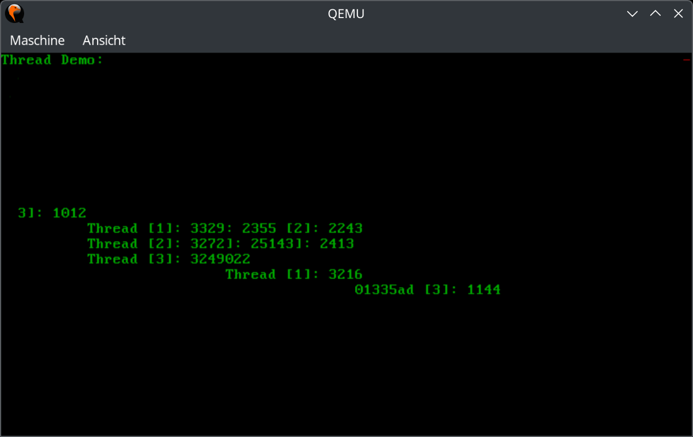
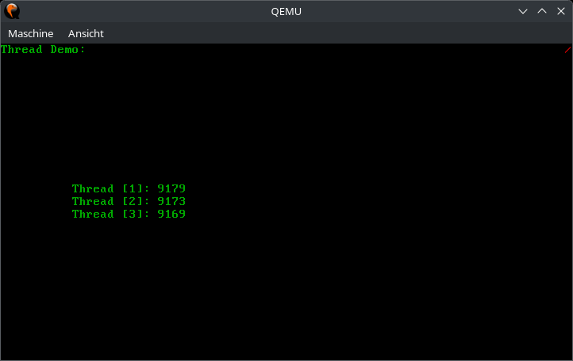

# Aufgabe 6: Synchronisierung

## Lernziele
1. Verstehen wie ein Spinlock sowie ein Guard funktioniert
2. Im Scheduler das Blockieren von Threads realisieren
3. Einen eigenen Mutex mit Warteschlange schreiben 

## A6.1: Umbau auf eigene Lock-Implementierung
In der Vorgabe finden sie die zwei Dateien `library/spinlock.rs` und `library/mutex.rs`, die sie in Ihr Projekt einbauen sollen. Sie sollen damit den bisher verwendeten Mutex aus der `spin`-Crate ersetzen. Dabei soll nachvollzogen werden können, wie Locks generell und speziell Guards in Rust funktionieren. Merh Details dazu finden Sie in den folgenden Aufgaben.

Kopieren Sie zunächst die beiden Dateien aus der Vorgabe in den Ordner `os/src/library` Ihres Projekts und ergänzen Sie die entsprechenden Zeilen in `os/src/library/mod.rs`. Ersetzen Sie nun in `cga.rs` den Mutex aus der `spin`-Crate durch den aus der Vorgabe. Die Mutex-API bleibt dabei gleich, es reich also oben in `devices/cga.rs` die Zeile `use spin::Mutex;` durch `use crate::library::mutex::Mutex;` auszutauschen.

Die Mutex-Implementierung aus der Vorgabe macht aktuell noch nichts und tut einfach bei jedem Aufruf von `lock()` und `try_lock()` so, als hätte man das Lock erfolgreich bekommen. Das heißt, dass Zugriffe auf den CGA-Bildschirm nun effektiv nicht mehr synchronisiert sind und mehrere mutable Referenzen auf `CGA` gleichzeitig existieren können. Wenn Sie nun einmal die Demo aus Aufgabe 5 starten, wird sich die Ausgabe der Zähler nicht mehr korrekt verhalten. Wo bisher jeder Thread seinen Zähler in einer eigenen Zeile ausgegeben hat, springt der Cursor nun wild zwischen den drei Zeilen herum und die Ausgabe geschieht kreuz und quer (ähnlich wie auf der unten stehenden Abbildung).

## A6.2: Implementierung eines einfachen Spinlocks
Implementieren Sie nun die leeren Methoden in `spinlock.rs`. Sie benötigen dafür die folgenden atomaren Methoden, die bereits in dem `Atomic` Struct aus der Rust `core` Bibliothek implementiert sind:
 - `store()`: Überschreibt den aktuellen Wert der atomaren Variable
 - `load()`: Liest den aktuellen Wert der atomaren Variable
 - `swap()`: Überschreibt den Wert der atomaren Variable und gibt den alten Wert zurück.
 
All diese Methoden kapseln atomare Operationen, die nicht unterbrochen werden können. Es ist daher nicht möglich, dass der Scheduler dazwischen "grätscht", während man eine der atomaren Operationen durchführt.

Das Prinzip eines Spinlocks ist simpel: In der `lock()`-Methode wird `true` in die Lock-Variable geschrieben. War der Wert vorher bereits `true`, so hält gerade ein anderer Thread das Lock. In diesem Fall wird in in einer Schleife erneut versucht das Lock zu bekommen, bis es klappt. War der Wert vorher `false`, wurde das Lock erfolgreich geholt und die Schleife kann verlassen werden.

Das dauerhafte Warten auf einen bestimmten Wert in einer Schleife nennt sich *Busy Waiting* (oder *Busy Polling*). Häufig möchte man dies vermeiden, da die CPU hier wertvolle Rechenzeit und auch Energie verschwendet. Wie wir das Busy Waiting vermeiden können, schauen wir uns in der nächsten Aufgabe mit der `Mutex`-Implementierung an. Um solche Busy Waiting Schleifen etwas zu optimieren, bietet x86 die Instruktion `pause` an. Diese soll am Ende eines jeden Schleifendurchlaufs ausgeführt werden um der CPU mitzuteilen, dass sie sich gerade in einer Busy Waiting Schleife befindet. Sie können diese Instruktion einfach mit einem einzeiligen `asm!()` Block in Ihren Rust-Code einbauen.

Testen Sie Ihren Spinlock indem Sie ihn zur Synchronisierung des CGA-Bildschirms nutzen. Dazu müssen sie einfach nur `use crate::library::mutex::Mutex;` durch `use crate::library::spinlock::Spinlock as Mutex;` ersetzen. Wenn alles klappt, sollten die drei Zähler-Threads nun wieder korrekt in ihre eigenen Zeilen schreiben.

Schauen Sie sich außerdem die Implementierung des Structs `SpinlockGuard` einmal genauer an. Dieses kapselt eine Referenz auf die synchronisierte Datenstruktur und ermöglicht durch Implementierung der `Deref` und `DerefMut` Traits einen transparent Zugriff auf diese. Die `drop()` Methode sorgt außerdem dafür, dass das Spinlock automatisch freigegeben wird, sobald das Scope in welchem das Lock geholt (und somit die Guard-Instanz angelegt) wurde, verlassen wird.

In den folgenden Dateien muss Code implementiert werden: `library/spinlock.rs` und `devices/cga.rs`. 

## A6.3: Mutex mit Warteschlange
Nun soll in `mutex.rs` ein Mutex mit einer Warteschlange implementiert werden. Falls ein Thread `lock()` aufruft und die Sperre nicht frei ist, soll der Thread blockiert werden. In diesem Fall soll der blockierte Thread in die Warteschlange des Mutex eingefügt und auf einen anderen Thread umgeschaltet werden. 

Wenn ein Thread die Sperre freigibt, also durch das Freigeben des Guards `unlock()` aufgerufen wird, soll geprüft werden, ob die Warteschlange nicht leer ist. Falls ein Thread dort vorhanden ist, soll dieser entfernt und in die Ready-Queue des Schedulers eingefügt werden. Dass heißt, dass nicht direkt auf den Thread umgeschaltet wird, der deblockiert wird.

In der Vorgabe finden Sie zwei neue Methoden in `scheduler.rs`, die Sie für den Mutex zuerst implementieren müssen. Die Methode `prepare_block()` schaltet die Interrupts ab und gibt anschließend den aktiven Thread, sowie den Rückgabewert von `cpu::disable_ints_nested()` zurück. Die Interrupts müssen abgeschaltet werden, da bei einem Thread-Wechsel zum jetzigen Zeitpunkt der aktuelle Thread verloren wäre. Er wurde aus dem Scheduler ausgehakt und es würde somit nie wieder zu ihm zurück gekehrt werden.

Die Methode `switch_from_blocked_thread()` nimmt einen Pointer auf den blockierten Thread entgegen, sowie den Rückgabewert von `cpu::disable_int_nested()` aus dem vorhergehenden Aufruf von `prepare_block()` und wechselt zum nächsten Thread. Die Interrupts werden durch den Thread-Wechsel automatisch wieder aktiviert (bzw. ist das abhängig vom Flags-Register des nächsten Threads). Nach `Thread::switch()` müssen wir sie jedoch mit Hilfe von `cpu::enable_int_nested()` wieder einschalten. Zu diesem Zeitpunkt wurde der blockierte Thread wieder fortgesetzt.

Implementieren Sie nun die leeren Funktionen in `mutex.rs`. Die Methode `lock()` soll hierbei den aktuellen Thread blockieren und in die Warteschlage des Mutex einhängen. In `unlock()` soll ein Thread aus der Warteschlange des Mutex ausgereiht und mit `scheduler::ready()` wieder in den Scheduler eingehangen werden. In `lock()` müssen Sie folgende Dinge beachten:
 - Wenn der Scheduler noch nicht initialisiert wurde, kann natürlich kein Thread blockiert werden. In dem Fall soll sich der Mutex einfach wie ein Spinlock verhalten.
 - Zum Einreihen des blockierten Threads in die Warteschlange des Mutex muss diese gelockt werden (sie ist ja bereits in der Vorgabe durch ein Spinlock geschützt). Da wir jedoch aus `scheduler::switch_from_blocked_thread()` erstmal nicht zurückkehren, bleibt die Warteschlage gelockt und beim nächsten Aufruf von `mutex::lock()` würde es zu einer Verklemmung kommen. Um das zu vermeiden sollte das Manipulieren der Warteschlange in einem eigenen Scope geschehen, so dass beim Verlassen dieses Scopes die Warteschlagen wieder freigegeben wird.

Bevor wir den Mutex in `cga.rs` verwenden können, müssen wir noch eine Sache beachten: Beim Aufruf von `lock()` oder `unlock()` werden jeweils drei verschiedene andere Locks geholt: Das Lock der Mutex-Warteschlange, das Lock des Schedulers (zum Blockieren/Deblockieren des Threads) und das Lock des Allokators (zum Einreihen/Ausreihen aus der Mutex-Warteschlange). Sollte eines dieser Locks gerade gehalten werden, während in `pit::trigger()` das Spinner-Symboler ausgegeben wird, führt dies zu einer Verklemmung im Interrupt Handler. Um dieses Problem zu Lösen wurde im Scheduler die neue Methode `is_locked()` eingeführt. Prüfen Sie in `pit::trigger()` ob der Scheduler, der Allokator und die Warteschlange des CGA-Mutex gerade frei sind, bevor Sie `CGA.try_lock()` aufrufen und das Spinner-Symbol aktualisieren. Das wirkt nach sehr viel Aufwand nur für die Aktualisierung eines Symbols, verdeutlicht jedoch, wie behutsam man Code in Interupt-Handlern implementieren muss.

In den folgenden Dateien muss Code implementiert werden: `library/mutex.rs`, `kernel/threads/scheduler.rs`, `devices/pit.rs`. 

## A6.4: Vergleich aller Lösungen

Lassen Sie nun in Ihrer Demo alle drei Threads bis zu einem bestimmten Wert zählen (z.B. 100000) und messen Sie dabei in jedem Thread die benötigte Zeit. Vergleichen Sie die neue Mutex-Implementierung mit dem Spinlock und dem Mutex aus der `spin`-Crate. Wie viel schneller rechnen die Threads mit unserer neuen Mutex-Implementierung?

Sie können nun *FAST* überall wo Ihr Betriebssytem den Mutex aus der `spin`-Crate verwendet stattdessen unseren neuen Mutex benutzen. Jedoch sollte `INT_VECTORS` in `kernel/interrupts/intdispatcher.rs` besser mit einem Spinlock synchronisiert werden, da hier eine ähnliche Problematik wie bei `pit:trigger()` besteht. Außerdem sollte der `SchedulerState` in `kernel/threads/scheduler.rs` ebenfalls durch ein Spinlock gesichert sein, da der Mutex selbst ja auch auf den Scheduler zugreift und es so zu rekursiven Aufrufen und Verklemmungen kommt.

Das System sollte weiterhin fehlerfrei funktionieren.
