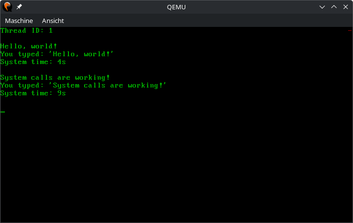

# Aufgabe 9: Systemaufrufe (Isolation und Schutz - Aufgabe 2)

## Lernziele
1. Verstehen wie Systemaufrufe funktionieren, um kontrolliert von Ring 3 in Ring 0 zu schalten und somit in kontrollierter Weise Funktionen des Kerns aufzurufen, welche wiederum privilegierte Instruktionen verwenden dürfen.

## A9.1: Interrupt Descriptor Table (IDT)
Ein sehr grundlegender Ansatz Systemaufrufe durchzuführen besteht darin, einen Software-Interrupt auszulösen (wie beispielsweise der Vektor 0x80 in Linux), um in den Ring 0 zu wechseln. Hierzu müssen wir einen Eintrag in der IDT verändern.

Aktuell ist unsere IDT komplett (256 Einträge) mit Interrupt Gates befüllt, die alle DPL=0 gesetzt haben und auf die Funktion `int_disp()` verweisen. Damit wir einen Systemaufruf mithilfe eines Software-Interrupts realisieren können benötigen wir in der IDT ein Trap-Gate mit DPL=3 (damit dieses aus dem User-Mode heraus zugegriffen werden darf). Wir überschreiben hierzu einfach den existierenden Eintrag an der Index-Position 0x80 (=Vektornummer)

Zum Erzeugen eines Trap-Gate Eintrags soll in `idt.rs` ein neue Funktion `new_trap_gate()` für das Struct `IdtEntry` implementiert werden.

*Achtung: Die bereits existierende Funktion `IdtEntry::new()` wurde in der Vorgabe zu `new_interrupt_gate()` umbenannt.*

Anschließend muss noch ein Trap Gate in der IDT installiert werden. Setzen Sie hierfür mit Hilfe der Funktion `IdtEntry::syscall_gate()` den Vektor 0x80 der IDT so, dass er auf die Funktion `syscall_dispatcher::syscall_disp()` verweist.

*Wichtige Information für diese Aufgabe finden Sie in Intel Software Developer’s Manual Volume 3 in Kapitel 6.11 IDT Descriptors.*

## A9.2: Syscall-Handler
Als nächstes muss der Syscall-Handler `syscall_disp()` in `syscall_dispatcher.rs` programmiert werden. Ergänzen Sie hierzu den fehlenden Code in `syscall_disp()`. Ein Systemaufruf soll folgendermaßen ablaufen:
1. Eine Anwendung schreibt die Nummer des gewünschten Systemaufrufs in das Register `rax` und löst dann mit `int 0x80` einen Software-Interrupt aus.
2. Durch unseren neuen IDT-Eintrag wird direkt die Funktion `syscall_disp()` angesprungen (dabei wurde von Ring 3 in Ring 0 gewechselt). Diese muss nun alle Register (außer `rax`) sichern, anschließend den Wert in `rax` nutzen um den richtigen Eintrag der Tabelle der Systemaufrufe zu finden und schließlich die entsprechende Funktion aus der Tabelle aufrufen.
3. Nun müssen alle Register (außer `rax`) wiederhergestellt werden und anschließend wird mit `iretq` in Ring 3 zur Anwendung zurückgekehrt. Der Rückgabewert des Systemaufrufs bleibt dabei in `rax` liegen und kann von der Anwendung verarbeitet werden.

Die User Mode API für **alle** Systemaufrufe befindet sich in der Datei `user_api.rs`. Hier ist bereits der Systemaufruf `usr_hello_world()` vorgegeben, welcher "Hello, world!" auf der seriellen Schnittstelle ausgibt.

Das kernelseitige Gegenstück zu `usr_hello_world()` heißt `sys_hello_world()` und befindet sich im Ordner `syscalls/functions/`. Hier sollen auch alle anderen Systemaufrufe implemnetiert werden Es bietet sich an, thematisch zusammenpassende Funktionen in Dateien zu gruppieren. Das bleibt jedoch Ihnen überlassen.

Zum Testen der Systemaufrufe finden Sie in der Vorgabe die Datei `user/aufgabe-9/syscall_demo.rs`, welche einen neuen User-Thread erzeugt, der die Funktion `syscall_test_thread()` ausführt. Rufen Sie hier `usr_hello_world()` auf um Ihre Implementierung zu testen. Wenn alles funktioniert sollte die Textausgabe der Funktion `sys_hello_world()`  auf der seriellen Schnittstelle zu sehen sein. *Wichtig: Hierfür werden Portbefehle verwendet, die im User-Mode nicht erlaubt sind. Durch den Systemaufruf wechseln wir jedoch in den Ring 0 können dann den Code ausführen.*

## A9.3: Weitere Systemaufrufe (mit Parametern)
Nachdem der erste Systemaufruf erfolgreich getestet wurde, sollen nun die nachfolgenden implementiert werden:
 - `usr_thread_yield()` -> `sys_thread_yield()`: Gibt freiwillig die CPU ab und wechselt zum nächsten Thread.
 - `usr_thread_exit()` -> `sys_thread_exit()`: Beendet den aktuell laufenden Thread -> In `threads.rs` kann anschließend die Funktion `kickoff_user_thread()` so geändert werden, dass sie `usr_thread_exit()` aufruft, statt am Ende eines User Threads in einer Dauerschleife hängen zu bleiben.
 - `usr_thread_get_id() -> usize` -> `sys_thread_get_id() -> u64`: Gibt die ID des aktuell laufenden Threads zurück.
 - `usr_get_system_time() -> usize` -> `sys_get_system_time() -> u64`: Gibt die Systemzeit in Millisekunden zurück.
 - `usr_print(msg: &str)` -> `sys_print(buffer: *const u8, len: usize)`: Gibt eine Nachricht an der aktuellen Position auf dem CGA-Bildschirm aus.
 - `usr_get_char() -> char` -> `sys_get_char() -> u64`: Gibt den nächsten Buchstaben aus dem Buffer des Tastatur zurück.
Für jede Funktion muss außerdem ein Eintrag in `user_api::SyscallFunction` angelegt werden.

Um Systemaufrufe mit Parametern zu unterstützen, müssen zusätzlich zu `syscall0(syscall: SyscallFunction)` auch noch Funktionen wie `syscall1(syscall: SyscallFunction, arg1: u64)`, `syscall2(syscall: SyscallFunction, arg1: u64, arg2: u64)`, etc. angelegt werden um bis zu fünf Parameter zu unterstützen. Die Parameter sollen für die Systemaufrufe in den Registern entsprechend der `System V AMD64 ABI` übergeben werden.

*Wichtige Information für die Parameterübergabe in Registern finden Sie in System V Application Binary Interface AMD64 Architecture Processor Supplement in Kapitel 3.2.3 Parameter Passing.*

Testen Sie Ihre Systemaufrufe in `syscall_demo::syscall_test_thread()` folgendermaßen: Zu Beginn soll der aktuelle Thread-ID auf dem CGA-Bildschirm ausgegeben werden. Anschließend sollen in einer Schleife Zeichen von der Tastatur eingelesen werden. Immer wenn Enter gedrückt wird, soll die eingegebene Zeile, sowie die aktuelle Systemzeit auf dem CGA-Bildschirm ausgegeben werden.

## A9.4: Schnelle Systemaufrufe (optional)
Systemaufrufe über ein Trap-Gate sind nicht sehr schnell. Daher wurden schnellere Varianten eingeführt: `sysenter`/`sysexit` (Intel) und `syscall`/`sysret` (AMD). Aus Gründen der Kompatibilität verwenden x86_64-Systeme letztere Variante. Um diese schnellere Variante zu nutzen muss die GDT dem geforderten Aufbau entsprechen.

Argumente können in den Registern übergeben werden, wie beim Interrupt-basierten Systemaufruf, aber es ist zu beachten, dass das Register RCX (4. Parameter) auch von der `syscall` Instruktion genutzt wird. Als Work-Around kann der 4. Parameter in einem anderen Register übergeben werden.

Als Präfix für die schnellen Systemaufrufe bietet sich beispielsweise `fast_` an.
